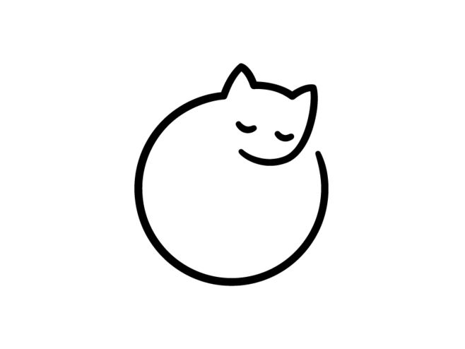

<br />
<div align="center">
  <a href="https://github.com/NekoOS-group/NekoOS">
    
  </a>

  <h3 align="center">NekoOS-Kernel</h3>
</div>

-----

<div align="center">
  <p align="center">
    A rust based risc-v operating system!
    <br />
    <a href="https://github.com/NekoOS-group/NekoOS"><strong>Explore the docs »</strong></a>
  </p>
</div>


<div align="center">
  <a href="https://github.com/NekoOS-group/NekoOS/graphs/contributors">
  </img></a>
  <a href="https://github.com/NekoOS-group/NekoOS/network/members">
  </img></a>
  <a href="https://github.com/NekoOS-group/NekoOS/stargazers">
  </img></a>
  <a href="https://github.com/NekoOS-group/NekoOS/issues">
  </img></a>
  <a href="https://github.com/NekoOS-group/NekoOS/blob/master/LICENSE.txt">
  </img>
  </a>
</div>

<div align="center">
  <p align="center">
    <br />
    <a href="https://github.com/NekoOS-group/NekoOS">View Demo</a>
    ·
    <a href="https://github.com/NekoOS-group/NekoOS/issues">Report Bug</a>
    ·
    <a href="https://github.com/NekoOS-group/NekoOS/issues">Request Feature</a>
  </p>
</div>

## About The Project

Do you want your os weak up with a "Nya!", try NekoOS!

Neko is kawaiiiiiiiii!

## Getting Start

### Prerequisites

Please install `rustup` and run the following commands then to setup the rust environment.

   ```
   rustup toolchain add nightly
   rustup target add riscv64gc-unknown-none-elf
   cargo install cargo-binutils
   rustup component add rust-src llvm-tools
   ```

Next, install `qemu-system-{ARCH}` for running the kernel in simulator and `gdb` or `lldb` for further debugging.

### Compile and Run

you can run with

```
make run LOG=INFO
```

## Environment Setup

### Prerequisites

1. Install Rust toolchain:
   ```bash
   curl --proto '=https' --tlsv1.2 -sSf https://sh.rustup.rs | sh
   ```

2. Install required Rust components:
   ```bash
   rustup toolchain add nightly
   rustup target add riscv64gc-unknown-none-elf
   cargo install cargo-binutils
   rustup component add rust-src llvm-tools
   ```

3. Install QEMU:
   - Ubuntu/Debian:
     ```bash
     sudo apt install qemu-system
     ```
   - macOS:
     ```bash
     brew install qemu
     ```

4. Verify installation:
   ```bash
   make check-env
   ```

## Todo List
  - kernel
    - [x] debug
      - [x] backtrace
    - [ ] dev
      - [ ] block
      - [ ] char
      - [x] console
      - [ ] cpu
      - [x] fdt
      - [x] timer 
    - [ ] fs
    - [ ] mm
      - [x] kernel heap(todo: oom handler)
      - [x] page table
      - [x] riscv64(sv39, todo: sv48, sv57, sv64)
      - [ ] riscv32(sv32)
    - [ ] syscall
    - [ ] schedule (todo: restructure shcedule into algorithm)
      - [ ] scheduler
      - [ ] task
        - [ ] abi
        - [ ] process
        - [ ] thread
        - [ ] idle
    - [x] trap(arch independent)
  - ulib

## Contribute

Contributions are what make the open source community such an amazing place to learn, inspire, and create. Any contributions you make are **greatly appreciated**.

If you have a suggestion that would make this better, please fork the repo and create a pull request. You can also simply open an issue with the tag "enhancement".
Don't forget to give the project a star! Thanks again!

1. Fork the Project
2. Create your Feature Branch (`git checkout -b feature/AmazingFeature`)
3. Commit your Changes (`git commit -m 'Add some AmazingFeature'`)
4. Push to the Branch (`git push origin feature/AmazingFeature`)
5. Open a Pull Request

<p align="right">(<a href="#readme-top">back to top</a>)</p>

## License

Distributed under the GPL-3.0 License. See `LICENSE.txt` for more information.

<p align="right">(<a href="#readme-top">back to top</a>)</p>

## Contact

bzy - [@bzyawa](https://twitter.com/bzyawa) - bzy.cirno@gmail.com

<p align="right">(<a href="#readme-top">back to top</a>)</p>